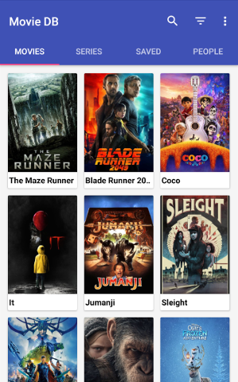
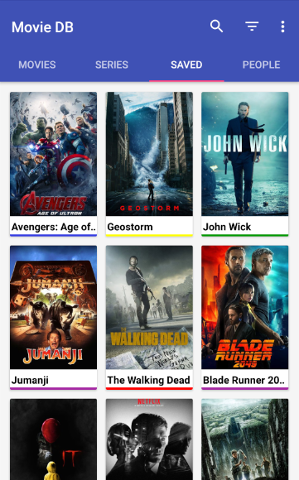
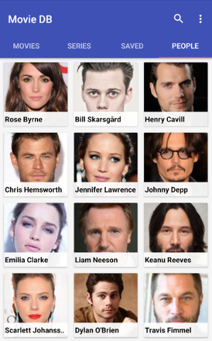
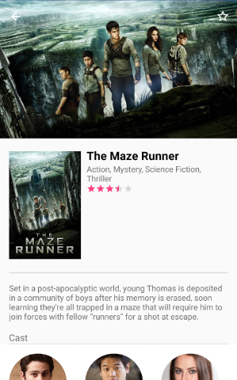
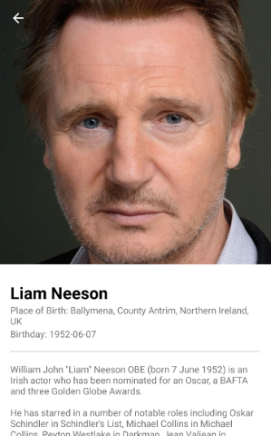
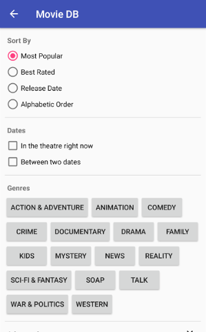

# MovieDB

MovieDB is an offline movie database android application. The movies are requested from [themoviedb.org](https://www.themoviedb.org), the database (called 'saved' in the application) is offline.

**Get it on [F-Droid](https://f-droid.org/repository/browse/?fdid=org.notabug.lifeuser.moviedb)!**

From version 2.0.0 onwards MovieDB makes use of [Semver](https://semver.org).

## Build instructions

This application can be compiled in android studio.

If you rather compile it in command line with gradle, go to the project directory:

Debug mode:

`./gradlew assembleDebug` or `./gradlew installDebug` to install the application on your phone.

Release mode:

`./gradlew assembleRelease`

## License

MovieDB is licensed under the GPL, version 3. A copy of the license is included [here](https://notabug.org/lifeuser/MovieDB/src/master/LICENSE).

The data that is provided by the API is not licensed under the GPL but rather holds copyright from the user that uploaded said content.

## Contributing

If you have anything you want to add or improve please do so!
I am far from perfect, so there's probably a lot that I've missed or that could be done better.

1. Fork it!
2. Create your feature branch: `git checkout -b my-new-feature/improvement`
3. Commit your changes: `git commit -m 'Add some feature/improvement`
4. Push to the branch: `git push origin my-new-feature/improvement`
5. Submit a pull request! :D

## Application screenshots

